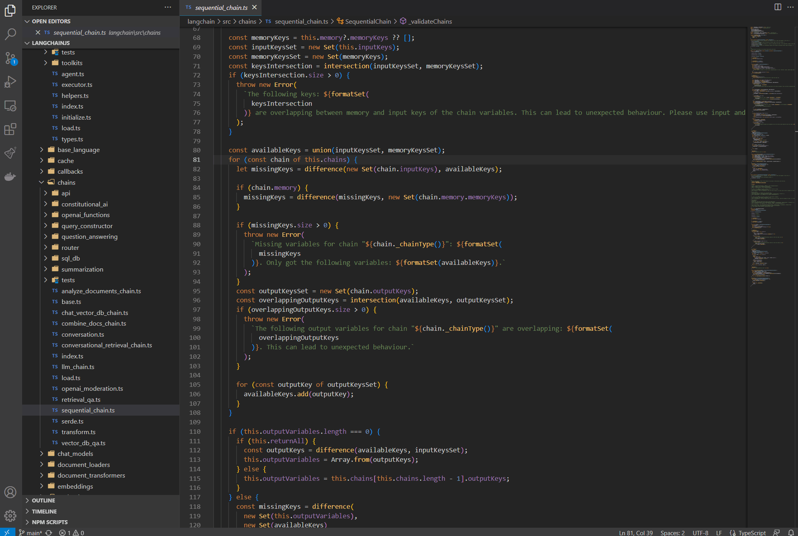

# gpt-investigate-extension

This is a VS Code extension designed to provide a detailed analysis of selected code snippets in a Git project, similar to how `git log` and `git blame` work. It utilizes the existing git project, GitHub and GPT to aggregate a summary of the current state of the selected code, its history, changes in its meaning, related commits, pull requests, and details of contributors who have worked on it.

## Features

1. **🔍 GPT Investigate**: Right-click on a selected code snippet in a Git project. Select "🔍 GPT Investigate". The extension will generate a concise detailed analysis of the code and its history in the project.

## Requirements

Git is required to be installed and accessible through your PATH. The extension will attempt to run git commands in the workspace directory.

## Limitations

- It will only work in the existing workspace which must be initialized as a git repo
- It hasn't been tested with Enterprise GitHub
- There is no way to swap out OpenAI for a local LLM

## Extension Settings

This extension contributes the following settings:

* `gptInvestigate.openAI.apiKey`: Sets the API Key for OpenAI. It can also be set using the `OPENAI_API_KEY` environment variable to protect your key from being included in your workspace settings.

* `gptInvestigate.git.accessToken`: Personal access token for GitHub to fetch PR information related to a commit. This is optional according to [GitHub documentation](https://docs.github.com/en/rest/overview/authenticating-to-the-rest-api?apiVersion=2022-11-28), but you'll be rate limited sooner without a PAT set. It can also be set using the `GIT_PAT` environment variable to protect your key from being included in your workspace settings.

* `gptInvestigate.openAI.temperature`: Sets the temperature for the model. Default 0.

* `gptInvestigate.openAI.modelName`: Name of the OpenAI model to use. Default gpt-3.5-turbo. gpt-4 will provide the best results but can be costly. If you're running into token limitations, try using gpt-3.5-turbo-16k.

* `gptInvestigate.openAI.maxTokens`: Sets the maxTokens for the API. Default -1, which is a smart token calculation from [langchain library](https://js.langchain.com/docs/get_started/introduction).
